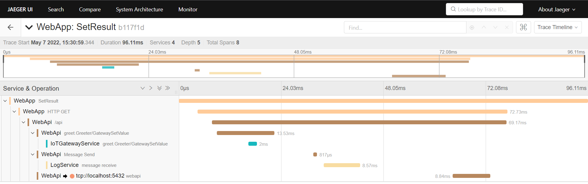
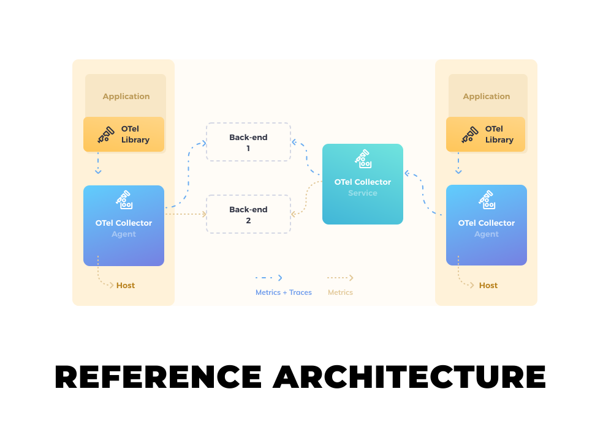
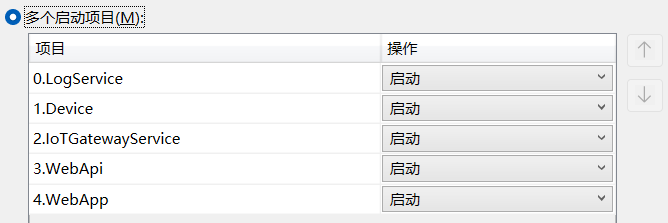
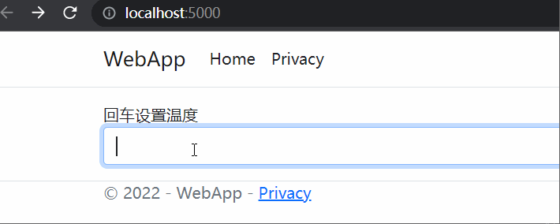
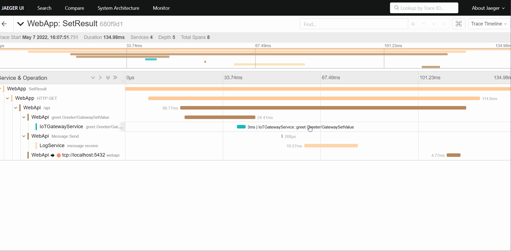
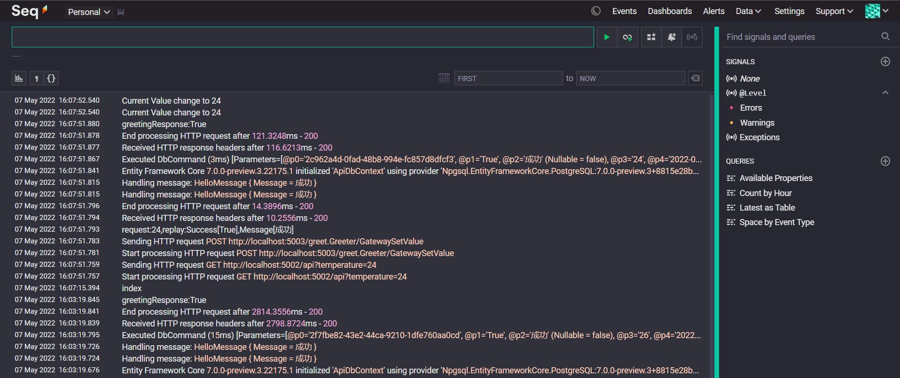

# ExploringIoTDistributedTracingNet6
> 探索链路追踪在.NET6工业物联网项目的应用
> 
> 框架列表

|                           Libary/Framework                        |   Versions  |   
| :---------------------------------------------------------------: | :---------: | 
| .NET                                                              |      6.0    |   
| OpenTelemetry                                                     | 1.3.0-beta.1|  
| OpenTelemetry.Exporter.Jaeger                                     | 1.3.0-beta.1|    
| OpenTelemetry.Extensions.Hosting                                  | 1.0.0-rc9.3 |       
| OpenTelemetry.Contrib.Instrumentation.EntityFrameworkCore         | 1.0.0-beta2 |       
| OpenTelemetry.Exporter.Console                                    | 1.0.0-beta2 |       
| OpenTelemetry.Instrumentation.AspNetCore                          | 1.0.0-rc9.3 |       
| OpenTelemetry.Instrumentation.GrpcNetClient                       | 1.0.0-rc9.3 |       
| OpenTelemetry.Instrumentation.Http                                | 1.0.0-rc9.3 |       
| OpenTelemetry.Instrumentation.AspNetCore                          | 1.0.0-rc9.3 |       


## 可能遇到的问题
> 工业物联网项目自上而下一般分为ERP、Mes、SCADA、WCS、边缘网关、设备等

> 一个生产订单从SAP发送到设备要经过上述多个系统，当某个环节出现问题，可能需要各个团队共同查找问题，最传统的做法是翻阅各个系统的日志文件，这无疑是非常糟糕和低效的。
>
> **APM系统**既可以帮你查找问题，又可以定位整个系统的瓶颈。

## 应用性能监控
> APM(Application Performance Monitor)，用来监控你的软件性能及行为。通常包括：
- ### Metrics 指标 
  > 如CPU、内存、磁盘I/O、网络I/O等
- ### Logs 日志 
  > 通常程序输出的不同等级日志Debug、Info、Error等
- ### Traces 分布式追踪
  > 包含请求中每个子操作的调用链路、开始和结束时间、传递的参数、对数据库的操作等

# OpenTelemetry


OpenTelemetry是谷歌和微软推出的一套平台无关、厂商无关的协议标准，是OpenTracing和OpenCensus的大统一，使得开发人员能够方便的添加或更换底层APM的实现。我们可以使用它的数据收集中间件：

> 生成、收集数据（Metrics,Logs and traces）

> 将数据推送到Jaeger(或Zipkin、SkyWalking等后端)

> 支持.Net、C++、Go、Java、js、Python等**11种语言（平台）**




可以采集.Net项目的AspNetCore、Http、EFCore、HttpClient、Grpc等诊断数据


官方代码段
```csharp 
// Define some important constants and the activity source
var serviceName = "MyCompany.MyProduct.MyService";
var serviceVersion = "1.0.0";
var builder = WebApplication.CreateBuilder(args);
// Configure important OpenTelemetry settings, the console exporter, and automatic instrumentation
builder.Services.AddOpenTelemetryTracing(b =>
{
    b
    .AddConsoleExporter()
    .AddSource(serviceName)
    .SetResourceBuilder(
        ResourceBuilder.CreateDefault()
            .AddService(serviceName: serviceName, serviceVersion: serviceVersion))
    .AddHttpClientInstrumentation()
    .AddAspNetCoreInstrumentation();
});
var app = builder.Build();
var httpClient = new HttpClient();
app.MapGet("/hello", async () =>
{
    var html = await httpClient.GetStringAsync("https://example.com/");
    if (string.IsNullOrWhiteSpace(html))
        return "Hello, World!";
    else
        return "Hello, World!";
});

app.Run();
```

## Jaeger
[Jaeger](https://www.jaegertracing.io/)是开源的分布式追踪系统，OpenTelemetry可以将收集到的数据导入到这个里面进行存储和查询。

## Seq
项目使用[seq](https://datalust.co/seq)作为日志平台，轻量且.Net友好，支持sql查询以及图表展示，你也可以使用**Nlog+Elasticsearch+Kibana**。

## 项目目录

```shell script
.
├──WebApp //webapp
├──WebApi //webapi
├──IoTGatewayService //模拟网关
├──Device //模拟设备
└──LogService //日志消费服务
```

> 项目介绍

|       项目        |   项目类型    |          作用          | 说明                                                         |
| :---------------: | :-----------: | :--------------------: | :----------------------------------------------------------- |
|      Device       |    控制台     | 模拟一个Modbus-TCP设备 | 当设定温度变化会输出日志                                     |
| IoTGatewayService |   Grpc服务    |   模拟数据采集的网关   | 开放设定温度的Grpc接口<br />使用Modbus协议将温度下发给设备   |
|      WebApi       |    WebApi     |    提供设定温度Api     | 接收用户输入的温度<br />使用Grpc调用网关服务<br />操作日志写入数据库<br />将操作日志发送到RabbitMq |
|      WebApp       |    Web应用    |        用户访问        | 接收用户输入的温度<br />调用WebApi<br />展示结果             |
|    LogService     | WorkerService |        后台服务        | 消费RabbitMq日志消息                                         |

## 启动方式
1. 使用docker-compose运行jaeger、rabbitmq、postgres、seq
```shell
   docker-compose up -d
```
2. VisualStudio启动多个项目

3. 访问[Web](http://localhost:5000/),输入设定温度，回车确认

4. 访问[Jaeger](http://localhost:16686/)，查看链路追踪

5. 访问[Seq](),查看日志 


## 采样率

> 项目中后期可使用过滤器或降低采样率来减小数据收集对系统性能的影响。

## 源码
在这里[ExploringIoTDistributedTracingNet6](https://github.com/iioter/ExploringIoTDistributedTracingNet6)

## 相关链接
[1] OpenTelemetry:*https://opentelemetry.io/docs/instrumentation/net/*

[2] Jaeger:*https://www.jaegertracing.io/*

[3] Seq:*https://datalust.co/seq*

[4] 源码:*https://github.com/iioter/ExploringIoTDistributedTracingNet6*

[5] IoTGateway:*https://github.com/iioter/iotgateway*

[6] opentelemetry文章:*https://mp.weixin.qq.com/s?__biz=MzAwNTMxMzg1MA==&mid=2654082294&idx=7&sn=472afb8235cd1dee322641b8add3e77c&chksm=80d830a3b7afb9b5dbba5cabe072a310820c75acf2097ad138c07b0792eab91ffbf340b43741&token=348599805&lang=zh_CN#rd*

## 求关注


