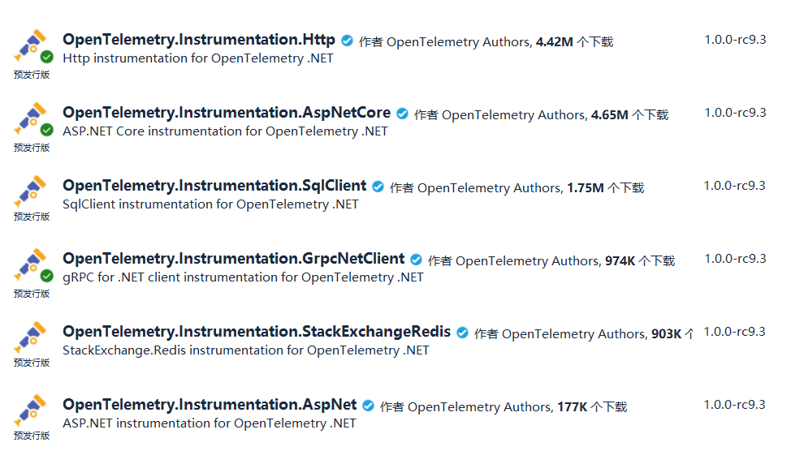

# ExploringIoTDistributedTracingNet6
> 探索链路追踪在.NET6工业物联网项目的应用
> 
> 如果觉得有用，请留言**学到了**
> 
> 已经知道的老哥，请留言**就这？**

## 可能遇到的问题
> 工业物联网项目自下而上一般分为设备、数采网关、SCADA系统、Mes系统、ERP系统等

> 一个订单从SAP发送到设备要经过上述多个系统，当某个环节出现问题，需要各个团队共同查找问题，最传统的做法是翻阅各个系统的日志文件，这无疑是非常糟糕的体验。
>
> **APM系统**既可以帮你查找问题，也可以容易的找出整个系统的瓶颈。

## 应用性能监控
> APM(Application Performance Monitor)，用来监控你的软件性能及行为。通常包括：
### Metrics 指标 
> 如CPU、内存、磁盘I/O、网络I/O等
### Logs 日志 
> 通常程序输出的不同等级日志Debug、Info、Error等
### Traces 分布式追踪
> 包含请求中每个子操作的调用链路、开始和结束时间、传递的参数、对数据库的操作等

# OpenTelemetry

OpenTelemetry是谷歌和微软推出的一个规范。我们可以使用它的数据收集中间件

> 生成、收集数据（Metrics,Logs and traces）

> 将数据推送到Jaeger(或Zipkin、SkyWalking等后端)

> 支持.Net、C++、Go、Java、js、Python等**11种语言**

> 可以采集.Net项目AspNetCore、Http、EFCore、HttpClient、Grpc、GrpcClient等诊断数据

```csharp
// Define some important constants and the activity source
var serviceName = "MyCompany.MyProduct.MyService";
var serviceVersion = "1.0.0";
var builder = WebApplication.CreateBuilder(args);
// Configure important OpenTelemetry settings, the console exporter, and automatic instrumentation
builder.Services.AddOpenTelemetryTracing(b =>
{
    b
    .AddConsoleExporter()
    .AddSource(serviceName)
    .SetResourceBuilder(
        ResourceBuilder.CreateDefault()
            .AddService(serviceName: serviceName, serviceVersion: serviceVersion))
    .AddHttpClientInstrumentation()
    .AddAspNetCoreInstrumentation();
});
var app = builder.Build();
var httpClient = new HttpClient();
app.MapGet("/hello", async () =>
{
    var html = await httpClient.GetStringAsync("https://example.com/");
    if (string.IsNullOrWhiteSpace(html))
        return "Hello, World!";
    else
        return "Hello, World!";
});

app.Run();
```

## Jaeger
[Jaeger](https://www.jaegertracing.io/)是开源的分布式追踪系统，opentelemetry可以将收集到的数据导入到这个里面进行存储和查询。

## Seq
**日志**是系统尤其重要的一部分，项目使用[seq](https://datalust.co/seq)作为日志平台，它对.net友好，支持sql查询以及图标展示，就不多介绍了。

## 项目目录

    ```shell script
    .
    ├──Device //模拟设备
    ├──IoTGatewayService //模拟网关
    ├──LogService //日志消费服务
    ├──WebApi //webapi
    └──WebApp //webapp
    ```

> 项目介绍

|       项目        |   项目类型    |          作用          | 说明                                                         |
| :---------------: | :-----------: | :--------------------: | :----------------------------------------------------------- |
|      Device       |    控制台     | 模拟一个Modbus-TCP设备 | 当设定温度变化会输出日志                                     |
| IoTGatewayService |   Grpc服务    |   模拟数据采集的网关   | 开放设定温度的Grpc接口<br />使用Modbus协议将温度下发给设备   |
|      WebApi       |    WebApi     |    提供设定温度Api     | 接收用户输入的温度<br />使用Grpc调用网关服务<br />操作日志写入数据库<br />将操作日志发送到RabbitMq |
|      WebApp       |    Web应用    |        用户访问        | 接收用户输入的温度<br />调用WebApi<br />展示结果             |
|    LogService     | WorkerService |        后台服务        | 消费RabbitMq日志消息                                         |

## 启动方式
1. 使用docker-compose运行jaeger、rabbitmq、postgres、seq
```shell
   docker-compose up -d
```
2. VisualStudio启动多个项目

3. 访问[Web](http://localhost:5000/),输入设定温度，回车确认

4. 访问[Jaeger](http://localhost:16686/)，查看链路追踪

5. 访问[Seq](),查看日志 


## 源码
在这里[ExploringIoTDistributedTracingNet6](https://github.com/iioter/ExploringIoTDistributedTracingNet6)

# 看到这里关注一下吧?